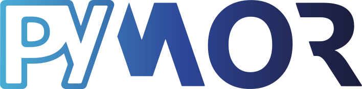

# pyMOR - Model Order Reduction with Python

pyMOR is a software library for building
[model order reduction](https://modelreduction.org/)
applications with the Python programming language.
All algorithms in pyMOR are formulated in terms of abstract interfaces,
allowing generic implementations to work with different backends,
from NumPy/SciPy to external partial differential equation solver packages.

## Features

* Reduced basis methods for parametric linear and non-linear problems.
* System-theoretic methods for linear time-invariant systems.
* Neural network-based methods for parametric problems.
* Proper orthogonal decomposition.
* Dynamic mode decomposition.
* Rational interpolation of data (Loewner, AAA).
* Numerical linear algebra (Gram-Schmidt, time-stepping, ...).
* Pure Python implementations of finite element and finite volume
  discretizations using the NumPy/SciPy scientific computing stack.

## License

pyMOR is licensed under BSD-2-clause.
See [LICENSE.txt](LICENSE.txt).

## Citing

If you use pyMOR for academic work, please consider citing our
[publication](https://epubs.siam.org/doi/10.1137/15M1026614):

    R. Milk, S. Rave, F. Schindler
    pyMOR - Generic Algorithms and Interfaces for Model Order Reduction
    SIAM J. Sci. Comput., 38(5), pp. S194--S216, 2016

## Installation via pip

pyMOR can easily be installed using Python package managers like
[pip](https://pip.pypa.io/en/stable/).
We recommend installation of pyMOR into a
[virtual environment](https://docs.python.org/3/tutorial/venv.html)
to avoid dependency conflicts.

For an installation with minimal dependencies, run

    pip install pymor

Since most included demo scripts require Qt bindings such as `pyside6` to function,
we recommend install pyMOR with the `gui` extra:

    pip install 'pymor[gui]'

The following installs the latest release of pyMOR on your system with most
optional dependencies:

    pip install 'pymor[full]'

To obtain an environment with the exact same package versions used in our
Linux continuous integration tests, you can use the
[requirements-ci-current.txt](https://raw.githubusercontent.com/pymor/pymor/main/requirements-ci-current.txt),
file from the pyMOR repository

    pip install -r requirements-ci-current.txt
    pip install pymor

If you are using a stable release, you should download the file from the
corresponding release branch of the repository.

## Additional dependencies

There are some optional packages not included with `pymor[full]`
because they need additional setup on your system:

* [mpi4py](https://mpi4py.readthedocs.io/en/stable/mpi4py.html):
  support of MPI distributed models and parallelization of greedy
  algorithms (requires MPI development headers and a C compiler):

      pip install mpi4py

* [Slycot](https://github.com/python-control/Slycot):
  dense matrix equation solvers for system-theoretic methods and
  H-infinity norm calculation (requires OpenBLAS headers and a
  Fortran compiler):

      pip install slycot

  Note that building Slycot might fail for the following reasons:

  * The Slycot package contains a cmake check which fails when it
    detects multiply NumPy include directories. This will cause the
    build to fail in venvs with any Python interpreter that has NumPy
    globally installed.
    To circumvent this problem, use another Python interpreter. If
    you do not want to build CPython yourself, you can use
    [pyenv](https://github.com/pyenv/pyenv),
    [uv](https://github.com/astral-sh/uv) or
    [mise-en-place](https://mise.jdx.dev/)
    to easily install another interpreter.
  * Slycot's build environment contains `numpy>=2`. However,
    scikit-builds's `FindF2PY.cmake`
    [will select any globally installed f2py3 executable](https://github.com/scikit-build/scikit-build/issues/449)
    to generate the Fortran wrapper code.
    On most systems, an older NumPy version is installed, whose
    f2py will generate incorrect wrapper code for `numpy>=2`.
    To mitigate this issue, install `numpy>=2` into your venv
    and link `f2py3` to `f2py` its `/bin` directory.
  * Building Slycot on Windows is challenging. We recommend using
    conda-forge packages instead. If you do not want to install
    the pyMOR conda-forge package, you can also `pip` install pyMOR
    into an existing conda environment.

  If you are on Linux and don't want to build Slycot yourself, you
  can try our experimental
  [manylinux wheels for Slycot](https://github.com/pymor/slycot-wheels/releases).

## Installation via conda

pyMOR is packaged in [conda-forge](https://conda-forge.org/) and can be installed
by running

    conda install -c conda-forge pymor

This will install pyMOR with its core dependencies into the current active conda
environment. To replicate an environment with most optional dependencies, which
is also used in our continuous integration tests, you can use the
[conda-linux-64.lock](https://raw.githubusercontent.com/pymor/pymor/main/conda-linux-64.lock),
[conda-osx-64.lock](https://raw.githubusercontent.com/pymor/pymor/main/conda-osx-64.lock),
[conda-win-64.lock](https://raw.githubusercontent.com/pymor/pymor/main/conda-win-64.lock)
lock files from the pyMOR repository:

    conda create -n pymorenv --file ./conda-{linux,osx,win}-64.lock
    conda activate pymorenv
    conda install pymor

## Documentation

Documentation is available [online](https://docs.pymor.org/).
We recommend starting with
[getting started](https://docs.pymor.org/latest/getting_started.html),
[tutorials](https://docs.pymor.org/latest/tutorials.html), and
[technical overview](https://docs.pymor.org/latest/technical_overview.html).

To build the documentation locally,
run the following from inside the root directory of the pyMOR source tree:

    make docs

This will generate HTML documentation in `docs/_build/html`.

## External PDE Solvers

pyMOR has been designed with easy integration of external PDE solvers in mind.

We provide bindings for the following solver libraries:

* [FEniCS](https://fenicsproject.org)

    MPI-compatible wrapper classes for dolfin linear algebra data structures are
    shipped with pyMOR (`pymor.bindings.fenics`).
    For an example see `pymordemos.thermalblock`, `pymordemos.thermalblock_simple`.
    It is tested using FEniCS version 2019.1.0.

* [deal.II](https://dealii.org)

    Python bindings and pyMOR wrapper classes can be found
    [here](https://github.com/pymor/pymor-deal.II).

* [NGSolve](https://ngsolve.org)

    Wrapper classes for the NGSolve finite element library are shipped with pyMOR
    (`pymor.bindings.ngsolve`).
    For an example see `pymordemos.thermalblock_simple`.
    It is tested using NGSolve version v6.2.2104.

A simple example for direct integration of pyMOR with a a custom solver
can be found in `pymordemos.minimal_cpp_demo`.

An alternative approach is to import system matrices from file and use
`scipy.sparse`-based solvers.

## Environments for pyMOR Development and Tests

Please see the [Developer Documentation](https://docs.pymor.org/latest/developer_docs.html).

## Contact

Should you have any questions regarding pyMOR or wish to contribute,
do not hesitate to send us an email at

    main.developers@pymor.org
