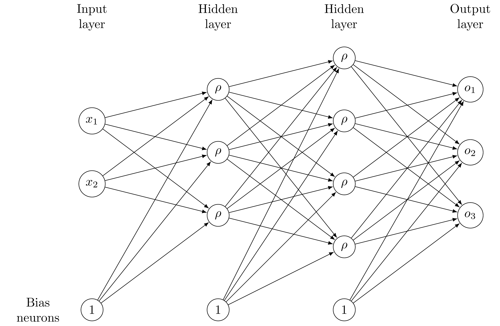

Tutorial: Model order reduction with artificial neural networks
===============================================================

.. include:: jupyter_init.txt

Recent success of artificial neural networks led to the development of several
methods for model order reduction using neural networks. pyMOR provides the
functionality for a simple approach developed by Hesthaven and Ubbiali in [HU18]_.
For training and evaluation of the neural networks, `PyTorch <https://pytorch.org>`_ is used.

In this tutorial we will learn about feedforward neural networks, the basic
idea of the approach by Hesthaven et al., and how to use it in pyMOR.

Feedforward neural networks
----------------------------

We aim at approximating a mapping :math:`h\colon\mathcal{P}\rightarrow Y`
between some input space :math:`\mathcal{P}\subset\mathbb{R}^p` (in our case the
parameter space) and an output space :math:`Y\subset\mathbb{R}^m` (in our case the
reduced space), given a set :math:`S=\{(\mu_i,h(\mu_i))\in\mathcal{P}\times Y: i=1,\dots,N\}`
of samples, by means of an artificial neural network. In this context, neural
networks serve as a special class of functions that are able to "learn" the
underlying structure of the sample set :math:`S` by adjusting their weights.
More precisely, feedforward neural networks consist of several layers, each
comprising a set of neurons that are connected to neurons in adjacent layers.
A so called "weight" is assigned to each of those connections. The weights in
the neural network can be adjusted while fitting the neural network to the
given sample set. For a given input :math:`\mu\in\mathcal{P}`, the weights between the
input layer and the first hidden layer (the one after the input layer) are
multiplied with the respective values in :math:`\mu` and summed up. Subsequently,
a so called "bias" (also adjustable during training) is added and the result is
assigned to the corresponding neuron in the first hidden layer. Before passing
those values to the following layer, a (non-linear) activation function
:math:`\rho\colon\mathbb{R}\rightarrow\mathbb{R}` is applied. If :math:`\rho`
is linear, the function implemented by the neural network is affine, since
solely affine operations were performed. Hence, one usually chooses a
non-linear activation function to introduce non-linearity in the neural network
and thus increase its approximation capability. In some sense, the input
:math:`\mu` is passed through the neural network, affine-linearly combined with the
other inputs and non-linearly transformed. These steps are repeated in several
layers.

The following figure shows a simple example of a neural network with two hidden
layers, an input size of two and an output size of three. Each edge between
neurons has a corresponding weight that is learnable in the training phase.

To train the neural network, one considers a so called "loss function", that
measures how the neural network performs on the training set :math:`S`, i.e.
how accurately the neural network reproduces the output :math:`h(\mu_i)` given
the input :math:`\mu_i`. The weights of the neural network are adjusted
iteratively such that the loss function is successively minimized. To this end,
one typically uses a Quasi-Newton method for small neural networks or a
(stochastic) gradient descent method for deep neural networks (those with many
hidden layers).

A possibility to use feedforward neural networks in combination with reduced
basis methods will be introduced in the following section.

A non-intrusive reduced order method using artificial neural networks
---------------------------------------------------------------------

We now assume that we are given a parametric pyMOR |Model| for which we want
to compute a reduced order surrogate |Model| using a neural network. In this
example, we consider the following two-dimensional diffusion problem with
parametrized diffusion, right hand side and Dirichlet boundary condition:

.. math::

    -\nabla \cdot \big(\sigma(x, \mu) \nabla u(x, \mu) \big) = f(x, \mu),\quad x=(x_1,x_2) \in \Omega,

on the domain :math:`\Omega:= (0, 1)^2 \subset \mathbb{R}^2` with data
functions :math:`f((x_1, x_2), \mu) = 10 \cdot \mu + 0.1`,
:math:`\sigma((x_1, x_2), \mu) = (1 - x_1) \cdot \mu + x_1`, where
:math:`\mu \in (0.1, 1)` denotes the parameter. Further, we apply the
Dirichlet boundary conditions

.. math::

    u((x_1, x_2), \mu) = 2x_1\mu + 0.5,\quad x=(x_1, x_2) \in \partial\Omega.

We discretize the problem using pyMOR's builtin discretization toolkit as
explained in :doc:`tutorial_builtin_discretizer`:

.. jupyter-execute::

    from pymor.basic import *

    problem = StationaryProblem(
          domain=RectDomain(),

          rhs=LincombFunction(
              [ExpressionFunction('ones(x.shape[:-1]) * 10', 2, ()), ConstantFunction(1., 2)],
              [ProjectionParameterFunctional('mu'), 0.1]),

          diffusion=LincombFunction(
              [ExpressionFunction('1 - x[..., 0]', 2, ()), ExpressionFunction('x[..., 0]', 2, ())],
              [ProjectionParameterFunctional('mu'), 1]),

          dirichlet_data=LincombFunction(
              [ExpressionFunction('2 * x[..., 0]', 2, ()), ConstantFunction(1., 2)],
              [ProjectionParameterFunctional('mu'), 0.5]),

          name='2DProblem'
      )

    fom, _ = discretize_stationary_cg(problem, diameter=1/50)

Since we employ a single |Parameter|, and thus use the same range for each
parameter, we can create the |ParameterSpace| using the following line:

.. jupyter-execute::

    parameter_space = fom.parameters.space((0.1, 1))

The main idea of the approach by Hesthaven et al. is to approximate the mapping
from the |Parameters| to the coefficients of the respective solution in a
reduced basis by means of a neural network. Thus, in the online phase, one
performs a forward pass of the |Parameters| through the neural networks and
obtains the approximated reduced coordinates. To derive the corresponding
high-fidelity solution, one can further use the reduced basis and compute the
linear combination defined by the reduced coefficients. The reduced basis is
created via POD.

The method described above is "non-intrusive", which means that no deep insight
into the model or its implementation is required and it is completely
sufficient to be able to generate full order snapshots for a randomly chosen
set of parameters. This is one of the main advantages of the proposed approach,
since one can simply train a neural network, check its performance and resort
to a different method if the neural network does not provide proper
approximation results.

In pyMOR, there exists a training routine for feedforward neural networks. This
procedure is part of a reductor and it is not necessary to write a custom
training algorithm for each specific problem. However, it is sometimes
necessary to try different architectures for the neural network to find the one
that best fits the problem at hand. In the reductor, one can easily adjust the
number of layers and the number of neurons in each hidden layer, for instance.
Furthermore, it is also possible to change the deployed activation function.

To train the neural network, we create a training and a validation set
consisting of 100 and 20 randomly chosen |parameter values|, respectively:

.. jupyter-execute::

    training_set = parameter_space.sample_uniformly(100)
    validation_set = parameter_space.sample_randomly(20)

In this tutorial, we construct the reduced basis such that no more modes than
required to bound the l2-approximation error by a given value are used.
The l2-approximation error is  the error of the orthogonal projection (in the
l2-sense) of the training snapshots onto the reduced basis. That is, we
prescribe `l2_err` in the reductor. It is also possible to determine a relative
or absolute tolerance (in the singular values) that should not be exceeded on
the training set. Further, one can preset the size of the reduced basis.

The training is aborted when a neural network that guarantees our prescribed
tolerance is found. If we set `ann_mse` to `None`, this function will
automatically train several neural networks with different initial weights and
select the one leading to the best results on the validation set. We can also
set `ann_mse` to `'like_basis'`. Then, the algorithm tries to train a neural
network that leads to a mean squared error on the training set that is as small
as the error of the reduced basis. If the maximal number of restarts is reached
without finding a network that fulfills the tolerances, an exception is raised.
In such a case, one could try to change the architecture of the neural network
or switch to `ann_mse=None` which is guaranteed to produce a reduced order
model (perhaps with insufficient approximation properties).

We can now construct a reductor with prescribed error for the basis and mean
squared error of the neural network:

.. jupyter-execute::

    from pymor.reductors.neural_network import NeuralNetworkReductor

    reductor = NeuralNetworkReductor(fom,
                                     training_set,
                                     validation_set,
                                     l2_err=1e-5,
                                     ann_mse=1e-5)

To reduce the model, i.e. compute a reduced basis via POD and train the neural
network, we use the respective function of the
:class:`~pymor.reductors.neural_network.NeuralNetworkReductor`:

.. jupyter-execute::

    rom = reductor.reduce(restarts=100)

We are now ready to test our reduced model by solving for a random parameter value
the full problem and the reduced model and visualize the result:

.. jupyter-execute::

    mu = parameter_space.sample_randomly(1)[0]

    U = fom.solve(mu)
    U_red = rom.solve(mu)
    U_red_recon = reductor.reconstruct(U_red)

    fom.visualize((U, U_red_recon),
                  legend=(f'Full solution for parameter {mu}', f'Reduced solution for parameter {mu}'))

Finally, we measure the error of our neural network and the performance
compared to the solution of the full order problem on a training set. To this
end, we sample randomly some |parameter values| from our |ParameterSpace|:

.. jupyter-execute::

    test_set = parameter_space.sample_randomly(10)

Next, we create empty solution arrays for the full and reduced solutions and an
empty list for the speedups:

.. jupyter-execute::

    U = fom.solution_space.empty(reserve=len(test_set))
    U_red = fom.solution_space.empty(reserve=len(test_set))

    speedups = []

Now, we iterate over the test set, compute full and reduced solutions to the
respective parameters and measure the speedup:

.. jupyter-execute::

    import time

    for mu in test_set:
        tic = time.time()
        U.append(fom.solve(mu))
        time_fom = time.time() - tic

        tic = time.time()
        U_red.append(reductor.reconstruct(rom.solve(mu)))
        time_red = time.time() - tic

        speedups.append(time_fom / time_red)

We can now derive the absolute and relative errors on the training set as

.. jupyter-execute::

    absolute_errors = (U - U_red).norm()
    relative_errors = (U - U_red).norm() / U.norm()

The average absolute error amounts to

.. jupyter-execute::

    import numpy as np

    np.average(absolute_errors)

On the other hand, the average relative error is

.. jupyter-execute::

    np.average(relative_errors)

Using neural networks results in the following median speedup compared to
solving the full order problem:

.. jupyter-execute::

    np.median(speedups)

Since :class:`~pymor.reductors.neural_network.NeuralNetworkReductor` only calls
the :meth:`~pymor.models.interface.Model.solve` method of the |Model|, it can easily
be applied to |Models| originating from external solvers, without requiring any access to
|Operators| internal to the solver.
